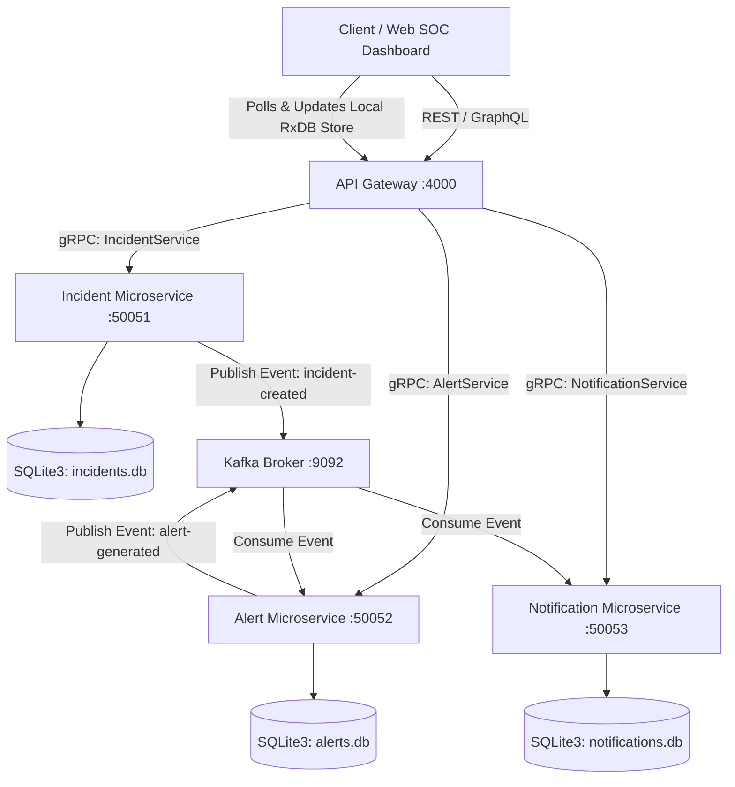

# Cyber Security Incident Detection Platform

A modern, production-grade microservices application developed in **Node.js** for real-time security threat detection, event generation, and log notification.

This platform utilizes **gRPC** for low-latency internal communication between the API Gateway and microservices, and **Apache Kafka** for asynchronous, event-driven orchestration. It contains dynamic frontend dashboarding utilizing client-side **RxDB** reactive database synchronization.

---

## 1. Global Architecture Diagram

The system architecture decouples public-facing entryways (REST/GraphQL) from high-throughput internal processors (gRPC/Kafka). Below is the Mermaid execution flow representing how incidents propagate from report to notification log:



---

## 2. Microservice Responsibilities & Communication Flow

### 1. API Gateway (Port 4000)
- **Role:** Single entry point for public clients.
- **REST Endpoints:** Exposes `/incidents`, `/incidents/:id`, `/incidents/:id/status`, `/alerts`, `/notifications`.
- **GraphQL Schema:** Exposes schema resolvers at `/graphql`.
- **Communication:** Serves client requests, converts them to gRPC calls, and maps responses. It also hosts the Static Security Operations Center (SOC) dashboard.

### 2. Incident Service (Port 50051)
- **Role:** Registers, modifies, and lists cyber incidents.
- **Persistence:** SQLite3 database (`incidents` table).
- **Communication:** Implements gRPC interface. Acts as a **Kafka Producer** by publishing an event to the `incident-created` topic whenever a new incident is saved.

### 3. Alert Service (Port 50052)
- **Role:** Threat analysis engine. Intercepts newly created incidents and issues security alerts.
- **Persistence:** SQLite3 database (`alerts` table).
- **Communication:** Implements gRPC interface. Acts as a **Kafka Consumer** on the `incident-created` topic, and a **Kafka Producer** by publishing to the `alert-generated` topic.

### 4. Notification Service (Port 50053)
- **Role:** Logs warning notifications and routes critical alerts to specialized security response groups.
- **Persistence:** SQLite3 database (`notifications` table).
- **Communication:** Implements gRPC interface. Acts as a **Kafka Consumer** on the `alert-generated` topic.

---

## 3. REST API Documentation

All REST routes are served by the API Gateway at `http://localhost:4000`.

### `POST /incidents`
Creates a security incident.
- **Request Body:**
  ```json
  {
    "title": "Subnet Bruteforce Attempt",
    "description": "Repetitive auth failures detected on server pool C",
    "severity": "HIGH"
  }
  ```
- **Response (201 Created):**
  ```json
  {
    "id": "1",
    "title": "Subnet Bruteforce Attempt",
    "description": "Repetitive auth failures detected on server pool C",
    "severity": "HIGH",
    "status": "OPEN",
    "createdAt": "2026-06-14T21:46:00.000Z"
  }
  ```

### `GET /incidents`
Lists all incidents registered in the system (ordered newest first).
- **Response (200 OK):**
  ```json
  {
    "incidents": [
      {
        "id": "1",
        "title": "Subnet Bruteforce Attempt",
        "description": "Repetitive auth failures detected on server pool C",
        "severity": "HIGH",
        "status": "OPEN",
        "createdAt": "2026-06-14T21:46:00.000Z"
      }
    ]
  }
  ```

### `GET /incidents/:id`
Retrieves details for a specific incident by ID.
- **Response (200 OK):**
  ```json
  {
    "id": "1",
    "title": "Subnet Bruteforce Attempt",
    "description": "Repetitive auth failures detected on server pool C",
    "severity": "HIGH",
    "status": "OPEN",
    "createdAt": "2026-06-14T21:46:00.000Z"
  }
  ```

### `PATCH /incidents/:id/status`
Updates an incident status (e.g., to `INVESTIGATING`, `RESOLVED`, or `CLOSED`).
- **Request Body:**
  ```json
  {
    "status": "INVESTIGATING"
  }
  ```
- **Response (200 OK):**
  ```json
  {
    "id": "1",
    "title": "Subnet Bruteforce Attempt",
    "description": "Repetitive auth failures detected on server pool C",
    "severity": "HIGH",
    "status": "INVESTIGATING",
    "createdAt": "2026-06-14T21:46:00.000Z"
  }
  ```

### `GET /alerts`
Retrieves all generated alerts. Used for real-time dashboard updates.
- **Response (200 OK):**
  ```json
  [
    {
      "id": "1",
      "incidentId": "1",
      "riskLevel": "HIGH",
      "message": "Security Alert: System detected incident ID 1 ('Subnet Bruteforce Attempt') with severity 'HIGH'...",
      "createdAt": "2026-06-14T21:46:01.123Z"
    }
  ]
  ```

### `GET /notifications`
Retrieves all generated notification logs.
- **Response (200 OK):**
  ```json
  [
    {
      "id": "1",
      "alertId": "1",
      "recipient": "incident-response-lead@company.local",
      "message": "[SOC SECURITY ALERT] Recipient notified. Risk: HIGH. Alert Details: ...",
      "sentAt": "2026-06-14T21:46:02.456Z"
    }
  ]
  ```

---

## 4. GraphQL Schema Documentation

Served at `http://localhost:4000/graphql`.

### Types
```graphql
type Incident {
  id: ID!
  title: String!
  description: String
  severity: String!
  status: String!
  createdAt: String!
  alerts: [Alert!]! # Related threats
}

type Alert {
  id: ID!
  incidentId: ID!
  riskLevel: String!
  message: String!
  createdAt: String!
}

type Notification {
  id: ID!
  alertId: ID!
  recipient: String!
  message: String!
  sentAt: String!
}
```

### Queries
- `incidents: [Incident!]!`: Lists all incidents.
- `incident(id: ID!): Incident`: Fetches a single incident by ID.
- `alerts: [Alert!]!`: Lists all security alerts.
- `alertsByIncident(incidentId: ID!): [Alert!]!`: Lists alerts matching an incident.
- `notifications: [Notification!]!`: Lists all notification dispatches.

### Mutations
- `createIncident(title: String!, description: String, severity: String!): Incident!`: Files a new incident.
- `updateIncidentStatus(id: ID!, status: String!): Incident!`: Mutates status.

---

## 5. Kafka Topics Documentation

The system utilizes two messaging topics inside the Kafka Broker:

### 1. Topic: `incident-created`
- **Publisher:** Incident Service
- **Subscriber:** Alert Service
- **Payload Schema:**
  ```json
  {
    "incidentId": "1",
    "title": "Subnet Bruteforce Attempt",
    "severity": "HIGH",
    "timestamp": "2026-06-14T21:46:00.000Z"
  }
  ```

### 2. Topic: `alert-generated`
- **Publisher:** Alert Service
- **Subscriber:** Notification Service
- **Payload Schema:**
  ```json
  {
    "alertId": "1",
    "incidentId": "1",
    "riskLevel": "HIGH",
    "message": "Security Alert: System detected incident ID 1...",
    "timestamp": "2026-06-14T21:46:01.123Z"
  }
  ```

---

## 6. Database Documentation

Each service connects to its own isolated **SQLite3** database file to maintain data autonomy (database-per-service microservice pattern).

### 1. Incident Service (`incidents.db`)
- **Table:** `incidents`
  | Field | Type | Modifiers | Description |
  |---|---|---|---|
  | `id` | INTEGER | PRIMARY KEY AUTOINCREMENT | Unique identifier |
  | `title` | TEXT | NOT NULL | Title of the event |
  | `description` | TEXT | | Descriptive detail |
  | `severity` | TEXT | NOT NULL | `LOW`, `MEDIUM`, `HIGH`, or `CRITICAL` |
  | `status` | TEXT | NOT NULL DEFAULT `'OPEN'` | `OPEN`, `INVESTIGATING`, `RESOLVED`, `CLOSED` |
  | `createdAt` | TEXT | NOT NULL | ISO Timestamp string |

### 2. Alert Service (`alerts.db`)
- **Table:** `alerts`
  | Field | Type | Modifiers | Description |
  |---|---|---|---|
  | `id` | INTEGER | PRIMARY KEY AUTOINCREMENT | Unique identifier |
  | `incidentId` | TEXT | NOT NULL | Associated Incident ID |
  | `riskLevel` | TEXT | NOT NULL | Computed threat rating |
  | `message` | TEXT | NOT NULL | Security notice text |
  | `createdAt` | TEXT | NOT NULL | Generation timestamp |

### 3. Notification Service (`notifications.db`)
- **Table:** `notifications`
  | Field | Type | Modifiers | Description |
  |---|---|---|---|
  | `id` | INTEGER | PRIMARY KEY AUTOINCREMENT | Unique identifier |
  | `alertId` | TEXT | NOT NULL | Triggering alert link |
  | `recipient` | TEXT | NOT NULL | Security group email |
  | `message` | TEXT | NOT NULL | Dispatched alert details |
  | `sentAt` | TEXT | NOT NULL | ISO Dispatch timestamp |

---

## 7. Installation & Execution Guide

### Prerequisites
- Node.js (v16+)
- Docker and Docker Compose (if running inside containerized network)

### Option A: Run Containerized (Recommended)
This sets up Zookeeper, Kafka, SQLite databases, and all 4 Node.js services inside a container network.

1. Start all containers:
   ```bash
   docker-compose up --build
   ```
2. Wait a few seconds for Zookeeper and Kafka to establish.
3. Open `http://localhost:4000` in your browser to view the SOC Dashboard.

---

### Option B: Run Locally (Bare-Metal)
If running locally, you must have an active Kafka instance at `localhost:9092` (you can start just Kafka/Zookeeper from Docker Compose using `docker-compose up zookeeper kafka`).

1. Install dependencies for all services from the root folder:
   ```bash
   npm run bootstrap
   ```
2. Start the services (in separate terminal windows):
   - **Terminal 1:** `npm run start:incident`
   - **Terminal 2:** `npm run start:alert`
   - **Terminal 3:** `npm run start:notification`
   - **Terminal 4:** `npm run start:gateway`
3. Launch the SOC Dashboard at `http://localhost:4000`.

---

## 8. Testing Guide

### 1. Dashboard Testing
1. Go to `http://localhost:4000`.
2. Fill out the "Report New Incident" form. Let's make one with Title `SQL Injection Attempt` and Severity `CRITICAL`.
3. Submit the form.
4. You will immediately see the incident added to the **Incident Queue**.
5. Within 2-3 seconds, the **Alert Service** (via Kafka subscriber) will generate a threat alert. You will see it slide into **Generated Threats / Alerts**.
6. Immediately following, the **Notification Service** (via Kafka subscriber) routing logic determines that since it's `CRITICAL` risk, the recipient is `incident-response-lead@company.local`. The dispatch log will appear in **SOC Dispatch Notification Logs**.
7. The local stats counters update.

### 2. REST API Testing
Create an incident:
```bash
curl -X POST http://localhost:4000/incidents \
  -H "Content-Type: application/json" \
  -d '{"title":"Malicious Scan","description":"IP 192.168.1.55 scanning port 445","severity":"MEDIUM"}'
```

Update status:
```bash
curl -X PATCH http://localhost:4000/incidents/1/status \
  -H "Content-Type: application/json" \
  -d '{"status":"INVESTIGATING"}'
```

### 3. GraphQL Playground Testing
Open `http://localhost:4000/graphql` in a browser.

**Query (List all incidents and nested alerts):**
```graphql
query {
  incidents {
    id
    title
    severity
    status
    createdAt
    alerts {
      id
      riskLevel
      message
    }
  }
}
```

**Mutation (Report Incident):**
```graphql
mutation {
  createIncident(
    title: "Unauthorized Firewall Alteration", 
    description: "Rule 14 modified without change request", 
    severity: "HIGH"
  ) {
    id
    title
    status
    createdAt
  }
}
```
